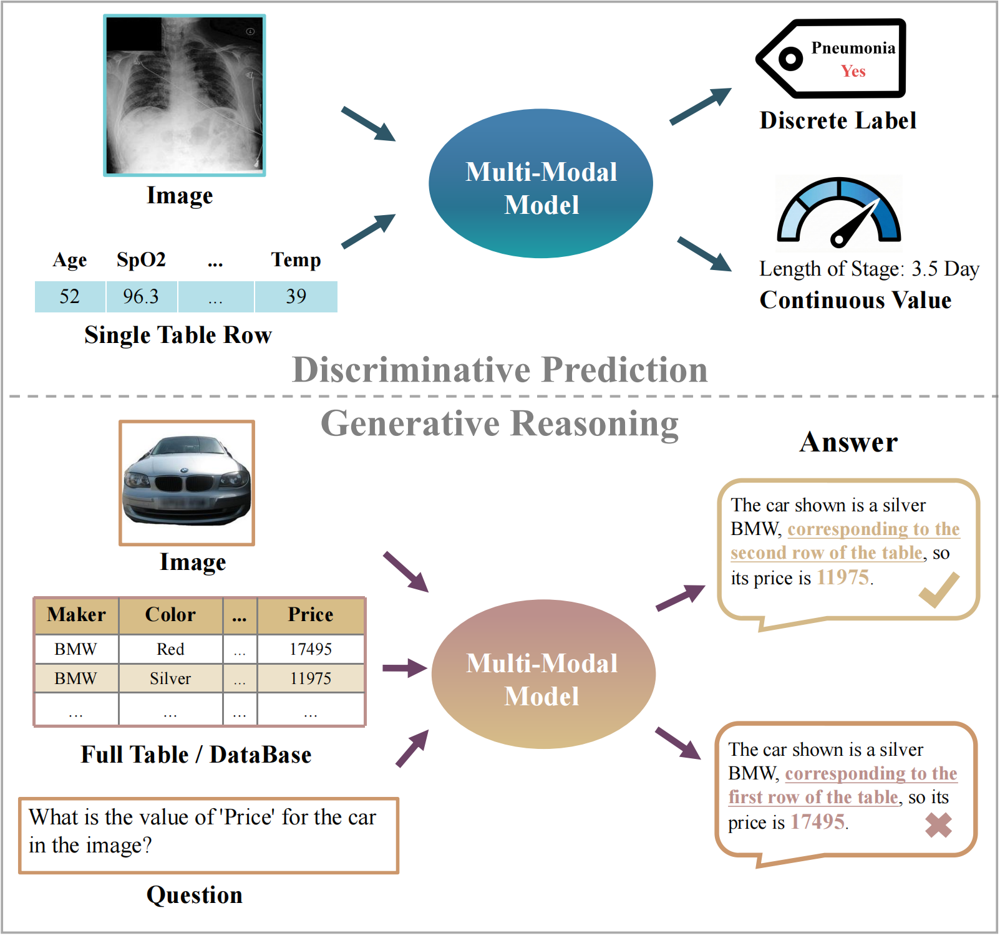

# <center> VT-Bench: A Unified Benchmark for Visual-Tabular Multi-Modal Learning </center>
## Introduction
**VT-Bench** is a unified benchmark for **vision–tabular multimodal learning**, designed to evaluate multimodal models under two major paradigms:

* **Discriminative prediction**: image + tabular record → class / value
* **Generative reasoning**: image + table/database + question → free-form answer

<div align="center">
  
  <figcaption> Two paradigms in vision–tabular multi-modal learning and the cross-modal grounding challenge in generative reasoning. </figcaption>
</div>

VT-Bench provides:
* **Broad model coverage**: vision-only models, tabular-only models, vision–tabular fusion models, and general-purpose VLMs
* **Diverse real-world scenarios**: 756K paired samples spanning 9 domains, covering both prediction and reasoning tasks
* **Unified evaluation**: consistent preprocessing, standardized interfaces, and optional modality diagnostic metrics for prediction


## Quickstart

### 1) Download

Clone the repository:

```bash
git clone https://anonymous.4open.science/r/VT-Bench-13C2.git
cd VT-Bench
```

### 2) Environment Setup

Create and activate the conda environment:

```bash
conda env create --file environment.yaml
conda activate vt_bench
```

Due to version incompatibilities, if you want to fine-tune Vision-Language Models, please use `environment_vlm.yaml` instead:

```bash
conda env create --file environment_vlm.yaml
conda activate vt_bench_vlm
```

### 3) Run Evaluation

You need to specify **five arguments**: `task`, `dataset`, `model`, `setting`, and `diagnostics`.

* **task**: `prediction` or `reasoning`
* **dataset**: choose a dataset identifier from the **Datasets** section
* **model**: choose a model name from the **Models** section

  * For VLMs, use the Hugging Face full identifier, e.g. `Qwen/Qwen3-VL-8B-Instruct`
* **setting**: controls evaluation configuration (varies across datasets; see **Datasets**)
* **diagnostics**: whether to compute additional modality diagnostic metrics for prediction tasks

  * options: `none` / `mcr` / `mir` / `full`
  * we also support computing MCR for a specified checkpoint

#### Example: Discriminative Prediction
```bash
python run.py --task prediction --dataset skin --model TIP --setting none --diagnostics mcr
```

Compute MCR for a specific checkpoint:
```bash
python run.py --task prediction --dataset skin --model TIP --setting none --diagnostics mcr   --checkpoint {YOUR_PRETRAINED_CKPT_PATH}
```

#### Example: Generative Reasoning
```bash
python run.py --task reasoning --dataset ehrxqa --model Qwen/Qwen3-VL-8B-Instruct --setting full --diagnostics none
```

For API Models (GPT-4.1 / Gemini-3-Flash-Preview), please export API keys before running:

```bash
export OPENAI_API_KEY='your_openai_api_key'
export GOOGLE_API_KEY='your_google_api_key'
```


## Datasets
### Discriminative Prediction Dataset
#### Public Dataset
| Dataset         | String Identifier | Availability                 | Source |
|---|---|---|---| 
|Skin Cancer      | `skin`            | Public| [kaggle]( https://www.kaggle.com/datasets/mahdavi1202/skin-cancer)|
|Breast Cancer    | `breast`         | Public| [kaggle]( https://www.kaggle.com/datasets/awsaf49/cbis-ddsm-breast-cancer-image-dataset)|
|Infarction       | `Infarction`      | Public Credentialized Access |[UK Biobank](https://www.ukbiobank.ac.uk/enable-your-research/apply-for-access)
|Adoption         | `adoption`        | Public| [kaggle](https://www.kaggle.com/competitions/petfinder-adoption-prediction)|
|CelebA           | `celebA`          | Public| [kaggle](https://www.kaggle.com/datasets/jessicali9530/celeba-dataset)|
|DVM-Car          | `dvm`             | Public| [DVM-Car](https://deepvisualmarketing.github.io/)|
|Pawpularity      | `pawpularity`     | Public| [kaggle](https://www.kaggle.com/competitions/petfinder-pawpularity-score)|
|Anime            | `anime`           | Public| [kaggle](https://www.kaggle.com/datasets/dbdmobile/myanimelist-dataset)|
|Pneumonia        | `pneumonia`       | Constructed| [MIMIC-IV](https://physionet.org/sign-dua/mimiciv/2.2/) & [MIMIC-CXR](https://physionet.org/sign-dua/mimic-cxr-jpg/2.0.0/)|
|Los              | `los`             | Constructed| [MIMIC-IV](https://physionet.org/sign-dua/mimiciv/2.2/) & [MIMIC-CXR](https://physionet.org/sign-dua/mimic-cxr-jpg/2.0.0/)|
|Respiratory Rat  | `rr`              | Constructed| [MIMIC-IV](https://physionet.org/sign-dua/mimiciv/2.2/) & [MIMIC-CXR](https://physionet.org/sign-dua/mimic-cxr-jpg/2.0.0/)|


#### Constructed Datasets 

The three constructed datasets (`pneumonia`, `los`, `rr`) are built from **MIMIC-CXR-JPG (v2.0.0)** and **MIMIC-IV (v2.2)**. These source datasets require a credentialed PhysioNet license. Due to the Data Use Agreement (DUA), only credentialed users can access the source data.

To access the source datasets, you must:
1. Become a [credentialed PhysioNet user](https://physionet.org/settings/credentialing/)
    - If you do not have a PhysioNet account, register for one [here](https://physionet.org/register/).
    - Follow these [instructions](https://physionet.org/credential-application/) for credentialing on PhysioNet.
    - Complete the "CITI Data or Specimens Only Research" [training course](https://physionet.org/about/citi-course/).
2. Sign the data use agreement (DUA) for each project
    - https://physionet.org/sign-dua/mimic-cxr-jpg/2.0.0/
    - https://physionet.org/sign-dua/mimiciv/2.2/


After obtaining access:
* The construction code is under: [dataset/Constructed_datasets/](https://anonymous.4open.science/r/VT-Bench-13C2/dataset/Constructed_datasets/)
* Update the file paths in [built_classification.py](https://anonymous.4open.science/r/VT-Bench-13C2/dataset/Constructed_datasets/built_classification.py) and [built_regression.py](https://anonymous.4open.science/r/VT-Bench-13C2/dataset/Constructed_datasets/built_regression.py)
* Download images via [download_newdataset_image.sh](https://anonymous.4open.science/r/VT-Bench-13C2/dataset/Constructed_datasets/download_newdataset_image.sh)

#### Preprocessing Scripts

All preprocessing scripts for prediction datasets are under [dataset/](https://anonymous.4open.science/r/VT-Bench-13C2/dataset/).
- Processing steps for the DVM dataset can be found [here](https://anonymous.4open.science/r/VT-Bench-13C2/dataset/preprocess_dvm).
- Processing steps for the Infarction dataset can be found [here](https://anonymous.4open.science/r/VT-Bench-13C2/dataset/preprocess_ukbb).

### Generative Reasoning Datasets

#### DVM-Car QA

* Generation script: [reasoning/DVM_QA/generate_qa.py](https://anonymous.4open.science/r/VT-Bench-13C2/VT-Bench/reasoning/DVM_QA/generate_qa.py).
* `setting` for DVM-Car QA should be a **list** specifying the tasks to evaluate:

  * `"loc"`: Row Localization
  * `"attr"`: Attribute Retrieval
  * `"count"`: Constrained Counting
  * `"mean"`: Conditional Mean

Example:

```bash
--setting '["loc","attr","count","mean"]'
``` 

#### MMQA

* See the official project page: [MMQA](https://allenai.github.io/multimodalqa/)
* Only supports full evaluation.

#### EHRXQA

* See the official repo: [EHRXQA]((https://github.com/baeseongsu/ehrxqa.git))
* Supported settings: `full` / `stage1` / `stage2`


## How to Add New Datasets

To integrate a new dataset, please provide a custom script that follows VT-Bench’s standard preprocessing pipeline:

1. Filter samples with missing labels or images, then split into train/val/test
2. Process tabular features:

   * impute missing values (mean for numeric; `"MISSING"` for categorical)
   * encode categorical features
   * normalize/standardize numeric features
3. Process images:

   * resize to **224 × 224**
   * store as `.npy`
4. Export model-ready files:

   * `.csv` feature files
   * `.pt` tensor files
     following the naming conventions used in existing datasets

A runnable example is provided here: [dataset/skin_cancer.ipynb](https://anonymous.4open.science/r/VT-Bench-13C2/dataset/skin_cancer.ipynb)


## Models

VT-Bench supports comprehensive evaluation of vision-tabular multi-modal learning models, including vision unimodal models, tabular unimodal models, vision-tabular multi-modal fusion models, and general-purpose vision-language models (VLMs). For discriminative prediction tasks, we implement adaptive hyperparameter optimization based on the Optuna framework. For generative reasoning tasks, VLMs are evaluated in a zero-shot setting using their official pretrained checkpoints.

### Vision Unimodal Models

1. **[ResNet-50](https://arxiv.org/abs/1512.03385)**: A 50-layer deep residual learning architecture that introduces identity skip connections to ease optimization and improve accuracy for large-scale visual recognition.

2. **[ViT-B/16](https://arxiv.org/abs/2010.11929)**: A pure Transformer architecture for vision that represents images as sequences of fixed-size patches and applies self-attention directly over patch tokens, achieving strong image classification performance with compute-efficient training.

### Tabular Unimodal Models

1. **[LightGBM](https://proceedings.neurips.cc/paper/2017/hash/6449f44a102fde848669bdd9eb6b76fa-Abstract.html)**: An efficient Gradient Boosting Decision Tree implementation optimized for large-scale, high-dimensional data, using Gradient-based One-Side Sampling and Exclusive Feature Bundling to improve training speed and scalability.

2. **[TabTransformer](https://arxiv.org/abs/2012.06678)**: A Transformer-based architecture that contextualizes categorical feature embeddings via self-attention, producing more informative and robust representations for tabular learning.

3. **[TabPFN v2](https://www.nature.com/articles/s41586-024-08328-6)**: A tabular foundation model trained on millions of synthetic datasets to perform general-purpose inference for supervised prediction on tables, frequently outperforming heavily tuned gradient-boosted tree ensembles with lower training overhead.

### Vision-Tabular Multi-Modal Models

1. **[Concat](https://www.sciencedirect.com/science/article/abs/pii/S105381191930031X)**: A parameter-efficient multi-task deep model that integrates structural imaging with demographic and clinical features through simple feature concatenation.

2. **[MAX](https://www.nature.com/articles/s41598-021-92799-4)**: A multi-modal deep learning framework that learns modality-specific representations from clinical variables and imaging data, then fuses them using element-wise maximum operation.

3. **[MUL](https://link.springer.com/chapter/10.1007/978-3-030-59713-9_24)**: An integrative CNN that uses channel-wise multiplicative fusion between imaging and non-imaging streams, yielding better performance than simple concatenation baselines.

4. **[DAFT](https://arxiv.org/abs/2107.05990)**: A lightweight conditioning module for CNNs that fuses imaging features with tabular variables by dynamically predicting per-channel scale and shift parameters and applying affine transforms to convolutional feature maps.

5. **[CHARMS](https://openreview.net/forum?id=v7I5FtL2pV)**: A cross-modal knowledge transfer method that aligns image channels with tabular features via optimal transport and mutual-information maximization, enabling selective transfer of visually relevant signals.

6. **[MMCL](https://arxiv.org/abs/2303.14080)**: A multi-modal contrastive pretraining framework that leverages paired imaging and tabular data to learn strong unimodal encoders, combining SimCLR-style image contrast with SCARF-style tabular augmentations.

7. **[TIP](https://arxiv.org/abs/2407.07582)**: A self-supervised tabular-image pre-training framework designed for multi-modal classification under incomplete tabular inputs, combining masked tabular reconstruction with image-tabular matching and contrastive objectives.

### VLMs

1. **[Table-LLaVA-v1.5-7B](https://arxiv.org/abs/2406.08100)**: A multi-modal table understanding model that answers table-centric instructions directly from table images, avoiding reliance on serialized formats and substantially outperforming recent open-source multi-modal baselines.

2. **[Qwen3-VL-8B-Instruct](https://arxiv.org/abs/2511.21631)**: An instruction-tuned variant of the Qwen3-VL family that supports interleaved text-image-video inputs with a native 256K-token context window for general-purpose multi-modal understanding and generation.

3. **[Qwen3-VL-8B-Thinking](https://arxiv.org/abs/2505.09388)**: A reasoning-oriented variant of Qwen3-VL that emphasizes stronger multi-step multi-modal reasoning across single-image, multi-image, and video tasks with enhanced spatiotemporal modeling capabilities.

4. **[InternVL3-8B](https://arxiv.org/abs/2504.10479)**: An open-source multi-modal LLM that performs native multi-modal pre-training, jointly learning vision and language from mixed multi-modal data and pure-text corpora in a single stage.

5. **[GLM-4.1V-9B-Thinking](https://arxiv.org/abs/2507.01006)**: A reasoning-oriented vision-language model trained with a large-scale multi-modal pre-trained vision backbone and curriculum-based reinforcement learning to enhance general-purpose multi-modal reasoning.

6. **[Llama-3.2-11B-Vision-Instruct](https://arxiv.org/abs/2407.21783)**: A multi-modal large language model that integrates visual reasoning capabilities into the Llama 3 architecture using a separately trained vision adapter with cross-attention layers.

7. **[Pixtral-12B](https://arxiv.org/abs/2410.07073)**: A 12B vision-language model trained for both natural images and documents, supporting flexible visual tokenization and handling multiple images within a long 128K-token context window.

8. **[GPT-4.1](https://openai.com/index/gpt-4-1/)**: A flagship large language model optimized for superior coding performance, instruction following, and long-context processing with a 1-million-token context window.

9. **[Gemini-3-Flash-Preview](https://storage.googleapis.com/deepmind-media/Model-Cards/Gemini-3-Flash-Model-Card.pdf)**: A lightweight Gemini-family model optimized for low-latency, cost-effective inference while retaining strong general-purpose reasoning and multi-modal capability.


## How to Add New Models

* For **generative reasoning**, add the Hugging Face / API calling logic in the corresponding evaluator scripts for each reasoning dataset.
* For **discriminative prediction**, add a new model function under `prediction/models/`.


## Acknowledgements
We would like to thank the following repositories for their great works:
- [TIP](https://github.com/siyi-wind/TIP.git)
- [MMCL](https://github.com/paulhager/MMCL-Tabular-Imaging.git)
- [CHARMS](https://github.com/LAMDA-Tabular/CHARMS.git)
- [EHRXQA](https://github.com/baeseongsu/ehrxqa.git)
- [MMQA](https://allenai.github.io/multimodalqa/)


